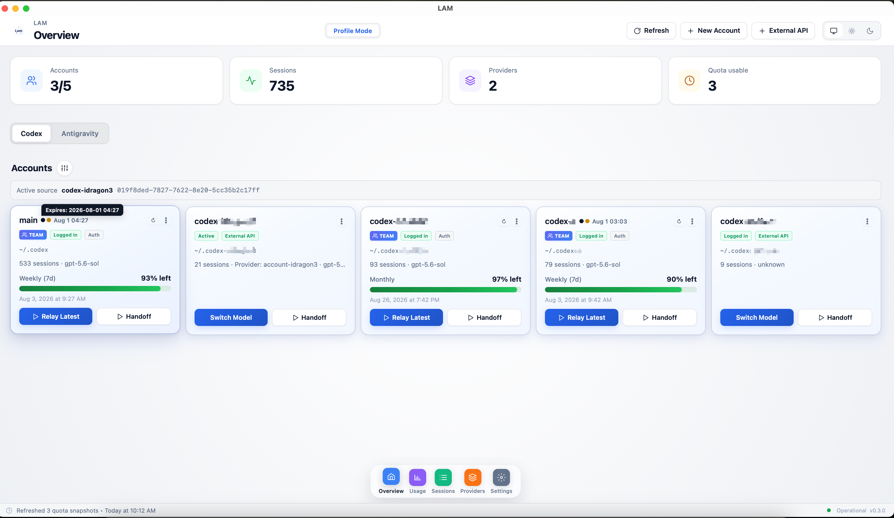
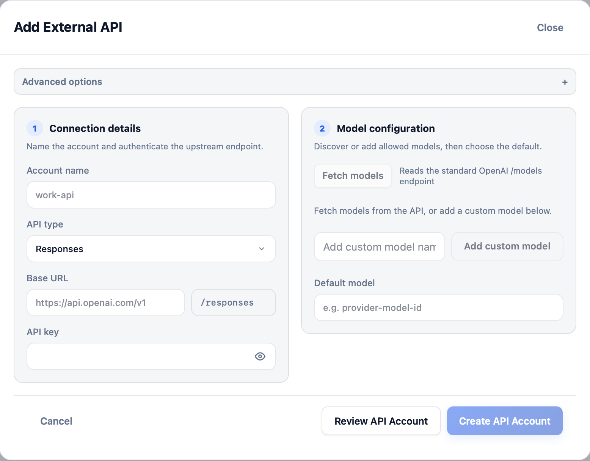
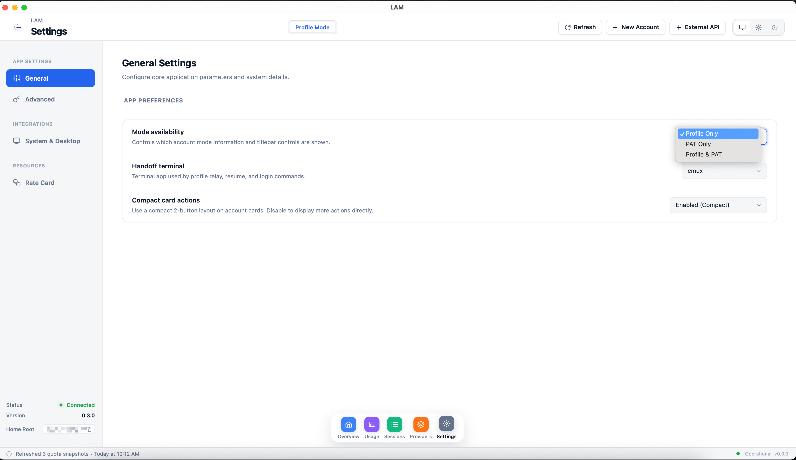
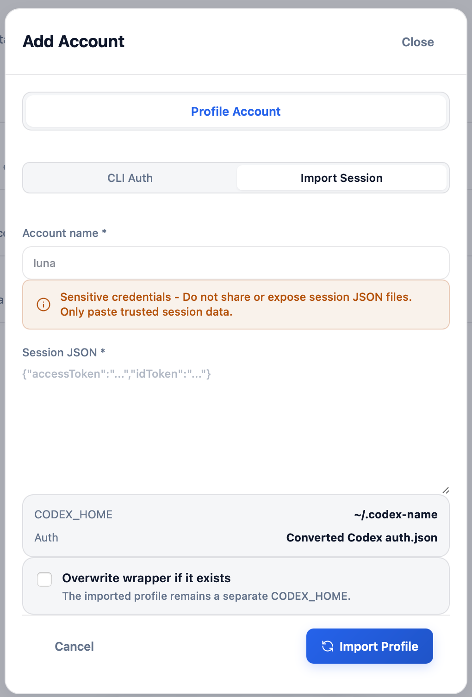
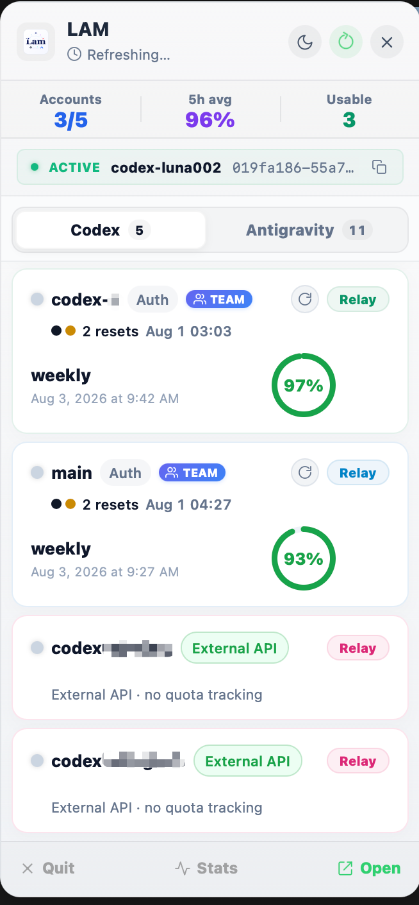
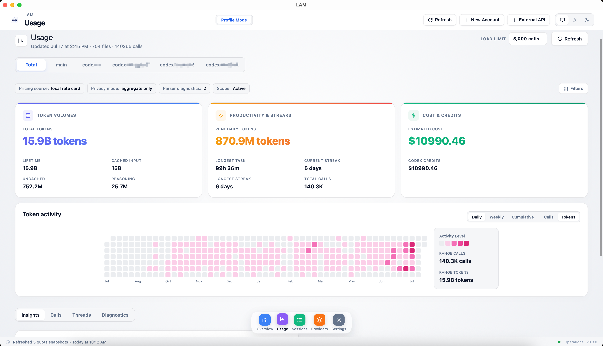

# LAM — Multi-Account Codex Runtime & Smart Gateway for macOS

> Break free from single-account quota limits and model boundaries: **Zero-leakage session handoff**, **Third-party / self-hosted API integration (Responses direct forwarding + Chat Completions local gateway adaptation)**, **One-click Session account import (sub2api-style)**, and **All-in-one quota monitoring (Codex & Antigravity)**.

[](https://github.com/lucas-zan/LAM/releases/tag/v0.4.0)
[-lightgrey.svg)]()
[](LICENSE)

**中文说明:** [`README.zh-CN.md`](README.zh-CN.md)

---

## Why Choose LAM?

Standard Codex CLI users with multiple accounts or third-party models often face frustrating dilemmas: manually cloning `~/.codex` directories leads to credential leaks, cross-account contamination, and corrupted databases; and because Codex strictly speaks the official Responses protocol, ordinary OpenAI-compatible `/chat/completions` endpoints cannot be used directly.

**LAM (Local Agent Manager) solves this completely:**

| Your Goal / Dilemma | Traditional Workaround | The LAM Solution |
| :--- | :--- | :--- |
| **Official quota exhausted mid-task** | Copying `~/.codex` trees, risking auth leakage and session conflicts | **Safe Session Handoff**: Migrates only the conversation JSONL, **never copies `auth.json`**, resume immediately on another account (`codex resume`) |
| **Use 3rd-party models (DeepSeek, Claude, self-hosted)** | Codex natively only supports Responses API; standard OpenAI endpoints fail | **Built-in Local Gateway**: Automatically adapts `/chat/completions` into Responses protocol, plug-and-play for any compatible API |
| **Upstream speaks Responses API** | Hand-editing `config.toml`, error-prone and tedious | **Direct Forwarding**: UI-driven API Account setup, one-click Fetch Models, clean managed config projection |
| **Have ChatGPT Session Token / JSON** | Jumping through browser OAuth flows every single time | **Session Import (sub2api-style)**: Paste Session JSON to instantly generate an isolated Profile or PAT account without browser round-trips |
| **Run multiple accounts concurrently** | Environment variable collisions, config overwrites in terminals | **Profile Mode**: Fully isolated `CODEX_HOME` and wrapper per account; run parallel sessions in different terminal windows |
| **Track quota and reset times at a glance** | Guessing or hitting rate limits before checking web dashboards | **macOS Menu Bar Popover**: Real-time 5h and weekly quota progress bars and reset countdowns for **both Codex and Google Antigravity** |



> **Note**: LAM does **not** embed the Codex CLI inside an electron/webview wrapper. Sessions, handoffs, and API profiles launch official Codex CLI instances in your external terminal (Terminal.app or Ghostty by default) using standard `CODEX_HOME` contracts, preserving full CLI fidelity.

---

## Architecture at a Glance

```
┌────────────────────────────────────────────────────────────────────────┐
│                              LAM Runtime                               │
├───────────────────────────────────┬────────────────────────────────────┤
│         Official Accounts         │         External API Accounts      │
│  • Profile Mode (isolated trees)  │  • Responses direct forwarding     │
│  • PAT Mode (single-tree swapping)│  • Chat Completions Local Gateway  │
│  • Session JSON Import (no OAuth) │  • Model Discovery & Allowlist     │
├───────────────────────────────────┴────────────────────────────────────┤
│                              Core Features                             │
│  • Zero-leakage Safe Session Handoff (`codex resume`)                  │
│  • macOS Menu Bar Quota Popover (Codex 5h/Weekly + Antigravity Groups) │
│  • Local Usage Dashboard (Tokens, Call Heatmaps, Estimated Cost)       │
└────────────────────────────────────────────────────────────────────────┘
```

---

## Key Features in Depth

### 1. External API Accounts: Responses Direct Forwarding + Chat Completions Local Gateway

Codex's official custom provider interface requires **`wire_api = "responses"`**. However, 95% of third-party model providers, proxies, and self-hosted inference servers only expose the standard OpenAI `/chat/completions` endpoint.

LAM provides a **dual-path protocol architecture** out of the box:

| Upstream Protocol | How LAM Connects | What Codex Sees | Typical Use Cases |
| :--- | :--- | :--- | :--- |
| **OpenAI Responses**<br>(`/v1/responses`) | **Direct Forwarding**: Projects Base URL, auth reference, and model configurations into the profile's managed `config.toml` | Official Responses Provider | Official-compatible Responses endpoints |
| **Chat Completions**<br>(`/chat/completions`) | **Local Gateway Adaptation**: Runs an authenticated, high-performance local Rust gateway (`lam-provider-gateway`) that translates Chat Completions to Responses with bi-directional streaming | Loopback Responses Endpoint<br>(`127.0.0.1`) | DeepSeek, Claude, third-party model hubs, self-hosted vLLM / Ollama |

* **Account-First Experience**: Set Base URL, API Key, and protocol in seconds.
* **One-Click Model Discovery (Fetch Models)**: Automatically queries the upstream `/models` endpoint, letting you pick allowed models and designate a default model.
* **Credential-by-Reference**: Secrets stay out of frontend states and plaintext configs.
* **Attach / Rebind / Detach Preview**: Full visual diff before applying changes, with fail-closed safety checks on incompatible tools or stateful history.



---

### 2. Official Account Modes: Profile Mode vs PAT Mode

Different developers have different multi-account workflows. LAM natively supports two distinct operational modes:

| Dimension | Profile Mode (Recommended) | PAT Mode (Single-Directory Mode) |
| :--- | :--- | :--- |
| **Under the Hood** | Each account gets its own `~/.codex-<name>` directory and wrapper script | All accounts share the default `~/.codex` directory, hot-swapping `auth.json` |
| **State Isolation** | **Complete Physical Isolation**: Configs, session history, caches, and auth are 100% independent | **Single-Point Overwrite**: The active account's credentials overwrite the default directory |
| **Concurrency** | **Supported**: Run different accounts simultaneously in separate terminal windows | **Not Supported**: Only one account can be active at any given moment |
| **Launch Method** | Launch via LAM or using the generated account wrapper command | Run standard system `codex` command directly in your shell |
| **Best For** | Power users running parallel tasks or needing strict work/personal separation | Users who prefer a single default directory and only swap accounts when quota runs out |

Switch between Profile and PAT display modes at any time in LAM Settings.



---

### 3. Fast Session Account Import (sub2api-style)

Skip repetitive browser OAuth logins with LAM's instant session import:

* **Paste Session JSON Directly**: Paste exported ChatGPT Session JSON (containing `accessToken`, `idToken`, etc.) or standard `auth.json`.
* **Automatic Profile / PAT Provisioning**: Automatically parses token expiration and plan type (Plus, Team, Enterprise, etc.), converting it into a ready-to-use Codex Profile with an isolated environment and wrapper.
* **CPA Export Support**: Export any active account's credentials to standard CPA JSON format for easy backup or migration between devices.



---

### 4. Zero-Leakage Safe Session Handoff

When account A hits its 5-hour or weekly limit, continue seamlessly on account B:

1. **Pick Session & Target**: Choose the active session and an account with remaining quota.
2. **Safe Context Transfer**: LAM **copies only the selected session's JSONL file**.
   * **Never copied**: `auth.json`, `config.toml`, SQLite databases, caches, tokens, or system installation IDs.
   * **Zero account cross-talk**: The target account's authentication remains completely untouched.
3. **Compatibility & Divergence Checks**: Pre-checks model compatibility; provides explicit divergence strategies (backup, prefer source, fork, timeline merge, summarization handoff).
4. **Instant Resume**: Triggers `codex resume <session-id>` in your configured terminal to pick up right where you left off.

---

### 5. macOS Menu Bar Quota Popover + Local Usage Insights

* **Always-On Menu Bar Popover**:
  * Click the menu bar icon anytime to inspect remaining percentages and reset countdowns for **5-hour sliding windows** and **weekly limits**.
  * **Dual Platform Support**: Monitors both Codex accounts and **Google Antigravity** model groups (Gemini Models, Claude & GPT models).
  * Direct action buttons for instant quota refresh and quick session resumes.
* **Local Usage Analytics**:
  * **Token Tracking**: Detailed breakdown of input, output, and total token consumption.
  * **Call & Thread Metrics**: Activity heatmaps, daily/weekly invocation counts, and active thread tracking.
  * **Cost Estimation**: On-device cost analysis calculated from model token metrics (not financial invoices).




---

## Privacy, Security, and Boundaries

LAM follows strict **Local-First** design principles:

- **No Cloud Services**: LAM does not run central user accounts, telemetry trackers, or servers. Your prompts, code, and sessions are never uploaded to LAM.
- **Auditable Network Traffic**: Outbound network traffic is limited to upstream quota checks, API requests, Gateway proxying, and local language server discovery. Local app data lives under `~/.lam`.
- **Fail-Closed Guarantee**: Handoff and API bindings abort safely with clear warnings whenever conflicts or incompatible states are detected.

For full security specifications, see [Security and Data Safety](docs/03-security-and-data-safety.md).

---

## Quick Start & Installation

### Download Preview Release (macOS Apple Silicon)

Download the pre-compiled application from the [Releases Page](https://github.com/lucas-zan/LAM/releases):

* **Direct Download**: [v0.4.0 DMG](https://github.com/lucas-zan/LAM/releases/tag/v0.4.0) (`LAM_0.4.0_aarch64.dmg`)
* Open the `.dmg` and drag `LAM.app` into your `Applications` folder.
* *Requirements: macOS 12+, working Codex CLI.*

### Build from Source

```bash
# 1. Clone repository
git clone https://github.com/lucas-zan/LAM.git
cd LAM

# 2. Install dependencies
make install

# 3. Start development mode
make start

# 4. Package release DMG
make dmg
```

---

## Makefile Commands

| Command | Purpose |
| :--- | :--- |
| `make install` | Install frontend and Rust dependencies |
| `make start` | Run Tauri dev mode with live reload |
| `make check` | Run frontend tests, TypeScript check, Clippy, and Rust unit tests |
| `make build` | Build production `.app` bundle |
| `make dmg` | Create installable macOS DMG image |

---

## Documentation & Architecture

* [Product Architecture Design](docs/01-product-design.md)
* [Security and Data Safety](docs/03-security-and-data-safety.md)
* [Desktop Runtime Design](docs/DESKTOP-RUNTIME.md)
* [Provider Gateway Contract Coverage](docs/remote-provider-gateway-contract-coverage.md)

---

## License

[MIT License](LICENSE) © 2026 LocalAgentManager contributors.
