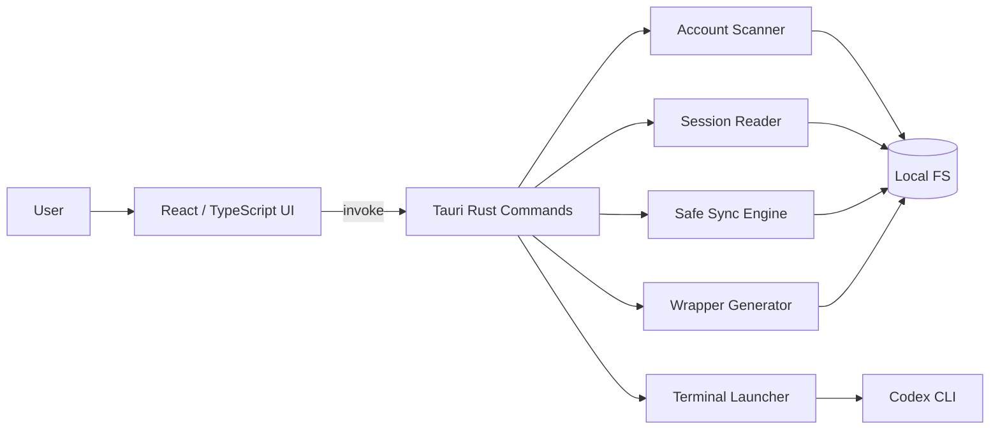

# 开发设计文档：Codex Relay / Codex Session Manager

> **历史草稿 / 部分有效：** 本文的 Tauri v2 + Rust + React 技术栈、Rust 服务分层、安全边界和部分命令草案仍可参考；当前模型、命名、阶段范围、Provider/Usage 分期和目标目录结构以 `docs/FINAL-DESIGN.md` 为准。实现时不要直接采用本文中的旧项目名、旧 metadata 文件名或旧路线图。

版本：0.1 draft  
技术栈：Tauri v2 + Rust + TypeScript/React + Vite  
平台：macOS first  
未来：Linux / Windows optional

---

## 1. 技术选型

### 1.1 推荐栈

```text
Desktop shell: Tauri v2
Backend: Rust
Frontend: TypeScript + React + Vite
UI: Tailwind CSS + shadcn/ui optional
State: Zustand or React Query
Packaging: Tauri bundler
```

### 1.2 选型理由

Tauri 适合该产品，因为：

1. 本产品需要大量本地文件系统操作，Rust 后端更适合集中处理安全边界。
2. 前端可使用 Web 技术快速构建管理界面。
3. App 比 Electron 更轻量。
4. Tauri command 模式适合把受控的本地能力暴露给前端。
5. 可将所有危险操作，例如写 `~/bin`、同步目录、打开 Terminal，放到 Rust 中校验。

---

## 2. 总体架构



### 2.1 关键边界

```text
React 前端：只表达用户意图，不直接拼接危险路径，不直接执行 shell。
Rust 后端：负责路径校验、文件操作、同步排除规则、命令构造。
Codex CLI：只通过 wrapper 或 CODEX_HOME 调用，不由 App 模拟登录。
```

---

## 3. 项目结构

```text
codex-relay/
├── README.md
├── package.json
├── src/
│   ├── App.tsx
│   ├── main.tsx
│   ├── lib/
│   │   ├── api.ts
│   │   ├── types.ts
│   │   └── format.ts
│   ├── components/
│   │   ├── AccountList.tsx
│   │   ├── AccountDetail.tsx
│   │   ├── SessionList.tsx
│   │   ├── CreateAccountDialog.tsx
│   │   ├── CreateRelayDialog.tsx
│   │   ├── SyncDialog.tsx
│   │   ├── SettingsDialog.tsx
│   │   └── SafetyBadge.tsx
│   └── routes/
│       └── Home.tsx
│
├── src-tauri/
│   ├── Cargo.toml
│   ├── tauri.conf.json
│   └── src/
│       ├── main.rs
│       ├── lib.rs
│       ├── models.rs
│       ├── errors.rs
│       ├── paths.rs
│       ├── safety.rs
│       ├── commands/
│       │   ├── mod.rs
│       │   ├── accounts.rs
│       │   ├── sessions.rs
│       │   ├── sync.rs
│       │   ├── wrappers.rs
│       │   ├── terminal.rs
│       │   └── settings.rs
│       └── services/
│           ├── account_scanner.rs
│           ├── session_parser.rs
│           ├── sync_engine.rs
│           ├── wrapper_writer.rs
│           └── terminal_launcher.rs
└── docs/
```

---

## 4. 数据模型

### 4.1 CodexAccount

```rust
#[derive(Debug, Clone, serde::Serialize)]
pub struct CodexAccount {
    pub id: String,
    pub display_name: String,
    pub codex_home: String,
    pub wrapper_path: Option<String>,
    pub has_auth: bool,
    pub has_config: bool,
    pub has_history: bool,
    pub session_count: usize,
    pub latest_session_modified_at: Option<String>,
    pub managed: bool,
    pub is_relay: bool,
    pub relay_source: Option<String>,
    pub relay_identity: Option<String>,
}
```

字段说明：

```text
id: codex account id，例如 main/a/b/luna/b-relay-a
display_name: UI 展示名称
codex_home: 绝对路径
wrapper_path: ~/bin/codex-luna
has_auth: auth.json 是否存在
managed: 是否由本 App 创建
is_relay: 是否为 relay 账号目录
relay_source: relay 来源，例如 a
relay_identity: 使用哪个账号身份登录，例如 b
```

### 4.2 CodexSession

```rust
#[derive(Debug, Clone, serde::Serialize)]
pub struct CodexSession {
    pub id: String,
    pub account_id: String,
    pub path: String,
    pub modified_at: String,
    pub size_bytes: u64,
    pub cwd: Option<String>,
    pub summary: Option<String>,
    pub first_user_message: Option<String>,
}
```

### 4.3 SyncPlan

```rust
#[derive(Debug, Clone, serde::Serialize)]
pub struct SyncPlan {
    pub from_account_id: String,
    pub to_account_id: String,
    pub operations: Vec<SyncOperation>,
    pub warnings: Vec<String>,
    pub blocked_files: Vec<String>,
}
```

### 4.4 SyncOptions

```rust
#[derive(Debug, Clone, serde::Deserialize)]
pub struct SyncOptions {
    pub sync_sessions: bool,
    pub backup_target_sessions: bool,
    pub sidecar_backup_history: bool,
    pub merge_history: bool,
    pub dry_run: bool,
}
```

默认值：

```text
sync_sessions = true
backup_target_sessions = true
sidecar_backup_history = false
merge_history = false
dry_run = true for preview, false for execution
```

---

## 5. Rust Command 设计

Tauri 前端通过 `invoke` 调用 Rust command。每个 command 必须：

1. 做参数校验。
2. 做路径 canonicalize。
3. 阻止访问预期目录之外的路径。
4. 返回结构化错误。
5. 不直接返回敏感内容。

### 5.1 accounts

```rust
#[tauri::command]
pub async fn list_accounts() -> Result<Vec<CodexAccount>, AppError>;

#[tauri::command]
pub async fn create_account(req: CreateAccountRequest) -> Result<CreateAccountResult, AppError>;

#[tauri::command]
pub async fn create_relay_account(req: CreateRelayAccountRequest) -> Result<CreateAccountResult, AppError>;

#[tauri::command]
pub async fn reveal_account_in_finder(account_id: String) -> Result<(), AppError>;
```

### 5.2 sessions

```rust
#[tauri::command]
pub async fn list_sessions(account_id: String) -> Result<Vec<CodexSession>, AppError>;

#[tauri::command]
pub async fn build_resume_command(req: ResumeCommandRequest) -> Result<ResumeCommandResult, AppError>;

#[tauri::command]
pub async fn reveal_session_in_finder(account_id: String, session_id: String) -> Result<(), AppError>;
```

### 5.3 sync

```rust
#[tauri::command]
pub async fn build_sync_plan(req: SyncRequest) -> Result<SyncPlan, AppError>;

#[tauri::command]
pub async fn execute_sync(req: SyncRequest) -> Result<SyncResult, AppError>;
```

### 5.4 wrappers

```rust
#[tauri::command]
pub async fn ensure_wrapper(account_id: String) -> Result<WrapperResult, AppError>;

#[tauri::command]
pub async fn check_wrapper_dir() -> Result<WrapperDirStatus, AppError>;
```

### 5.5 terminal

```rust
#[tauri::command]
pub async fn open_terminal_with_command(command: String, terminal: Option<String>) -> Result<(), AppError>;

#[tauri::command]
pub async fn copy_to_clipboard(command: String) -> Result<(), AppError>;
```

---

## 6. 路径策略

### 6.1 账号目录发现

默认扫描：

```bash
$HOME/.codex
$HOME/.codex-*
```

账号 id 规则：

```text
~/.codex          -> main
~/.codex-a        -> a
~/.codex-luna     -> luna
~/.codex-b-relay-a -> b-relay-a
```

### 6.2 wrapper 目录

默认：

```bash
~/bin
```

wrapper 名称：

```bash
codex-main 可选
codex-a
codex-luna
codex-b-relay-a
```

### 6.3 命名校验

推荐规则：

```regex
^[a-zA-Z0-9][a-zA-Z0-9_-]{0,31}$
```

拒绝：

```text
空字符串
包含 /
包含 ..
包含 ~
包含空格
以 - 开头
超过 32 字符
```

---

## 7. wrapper 设计

生成文件：

```bash
~/bin/codex-luna
```

内容：

```bash
#!/bin/zsh
export CODEX_HOME="$HOME/.codex-luna"
exec codex "$@"
```

权限：

```bash
chmod 755 ~/bin/codex-luna
```

注意：

- wrapper 不包含 token。
- wrapper 不硬编码用户名绝对路径，使用 `$HOME`。
- wrapper 参数全部透传。

---

## 8. 同步引擎设计

### 8.1 默认同步行为

只同步：

```bash
sessions/
```

默认不碰：

```bash
auth.json
config.toml
history.jsonl
logs_2.sqlite*
state_*.sqlite
installation_id
cache/
tmp/
```

### 8.2 sync sessions algorithm

伪代码：

```rust
fn sync_sessions(from: PathBuf, to: PathBuf, options: SyncOptions) -> Result<SyncResult> {
    ensure_safe_codex_home(&from)?;
    ensure_safe_codex_home(&to)?;
    ensure_not_same_path(&from, &to)?;

    let from_sessions = from.join("sessions");
    let to_sessions = to.join("sessions");

    if options.backup_target_sessions && to_sessions.exists() {
        backup_dir(&to_sessions, backup_name_with_timestamp())?;
    }

    copy_dir_merge(&from_sessions, &to_sessions, CopyPolicy {
        overwrite_same_path: false,
        skip_existing_same_size: true,
        preserve_mtime: true,
    })?;

    Ok(report)
}
```

### 8.3 history policy

默认：不复制。

可选旁路备份：

```bash
~/.codex-b-relay-a/history.from-a.2026-05-26T143000.jsonl
```

危险高级选项：合并到目标 `history.jsonl`。该功能 v0.1 不实现，后续需明确交互确认。

---

## 9. Session 解析策略

Codex session 文件格式可能变化，所以解析必须保守：

1. 文件名可作为 session id fallback。
2. 优先扫描 JSONL / JSON 字段中的：
   - `id`
   - `session_id`
   - `cwd`
   - `working_dir`
   - `summary`
   - 第一条 user message
3. 解析失败不报错，UI 显示 unknown。
4. 不修改 session 文件内容。

### 9.1 Parser API

```rust
pub fn parse_session_metadata(path: &Path) -> CodexSessionMetadata
```

返回：

```rust
pub struct CodexSessionMetadata {
    pub session_id: Option<String>,
    pub cwd: Option<String>,
    pub summary: Option<String>,
    pub first_user_message: Option<String>,
}
```

---

## 10. Terminal 启动设计

### 10.1 macOS Terminal.app

推荐生成 AppleScript：

```applescript
tell application "Terminal"
  activate
  do script "cd '/project' && CODEX_HOME='/Users/me/.codex-luna' codex resume 'session-id'"
end tell
```

Rust 通过 `osascript` 执行。所有 shell 参数必须经过单引号 escape。

### 10.2 iTerm2 / Warp / Ghostty

v0.1 可只支持：

```text
Terminal.app
Copy command
```

后续版本再支持其他 terminal。

---

## 11. 前端设计

### 11.1 API wrapper

```ts
import { invoke } from "@tauri-apps/api/core";

export function listAccounts() {
  return invoke<CodexAccount[]>("list_accounts");
}

export function listSessions(accountId: string) {
  return invoke<CodexSession[]>("list_sessions", { accountId });
}
```

### 11.2 状态管理

建议使用 React Query：

```text
accounts query
sessions query per account
sync mutation
create account mutation
```

### 11.3 错误展示

Rust 返回：

```json
{
  "code": "INVALID_ACCOUNT_NAME",
  "message": "Account name can only contain letters, numbers, dash, and underscore.",
  "recoverable": true
}
```

前端显示用户友好的中文/英文文案。

---

## 12. 安全设计

### 12.1 文件黑名单

任何同步操作必须硬编码排除：

```text
auth.json
*.sqlite
*.sqlite-shm
*.sqlite-wal
installation_id
cache/
tmp/
log/
logs/
```

### 12.2 认证安全

App 不读取、展示、复制、上传 `auth.json` 内容。只检查是否存在。

### 12.3 Dry-run

所有写操作都应支持 dry-run：

```text
将创建哪些目录
将写入哪些文件
将复制多少 session 文件
将备份哪个目录
哪些文件被阻止
```

### 12.4 Backup

同步目标 session 前默认备份：

```bash
sessions.backup.20260526-143000
```

---

## 13. 测试策略

### 13.1 Rust 单元测试

覆盖：

```text
account name validation
codex home path resolution
wrapper content generation
safe shell escaping
sync blacklist
session metadata parser fallback
```

### 13.2 集成测试

用临时目录模拟：

```text
.fake-home/.codex-a
.fake-home/.codex-b
.fake-home/.codex-b-relay-a
```

测试：

```text
create account
create relay account
sync sessions
history sidecar backup
dangerous files not copied
```

### 13.3 手工测试矩阵

```text
macOS Apple Silicon
macOS Intel
codex installed via bun
codex installed via npm
~/bin in PATH
~/bin not in PATH
Terminal.app permission denied
```

---

## 14. 发布设计

### 14.1 开源仓库

建议目录：

```text
.github/workflows
src
src-tauri
docs
examples
```

### 14.2 Release artifacts

v0.1：

```text
macOS .dmg
macOS .app.zip
source code
```

### 14.3 安装文档

必须说明：

```text
App 不包含 Codex CLI，用户需要先安装 Codex。
App 不同步 auth.json。
App 默认只同步 sessions/。
使用 relay 目录避免污染目标账号。
```

---

## 15. 参考资料

- OpenAI Codex CLI: https://developers.openai.com/codex/cli
- OpenAI Codex CLI features / resume: https://developers.openai.com/codex/cli/features
- OpenAI Codex CLI reference: https://developers.openai.com/codex/cli/reference
- Tauri calling Rust from frontend: https://v2.tauri.app/develop/calling-rust/
- Tauri security: https://v2.tauri.app/security/
- Tauri shell plugin: https://v2.tauri.app/plugin/shell/
