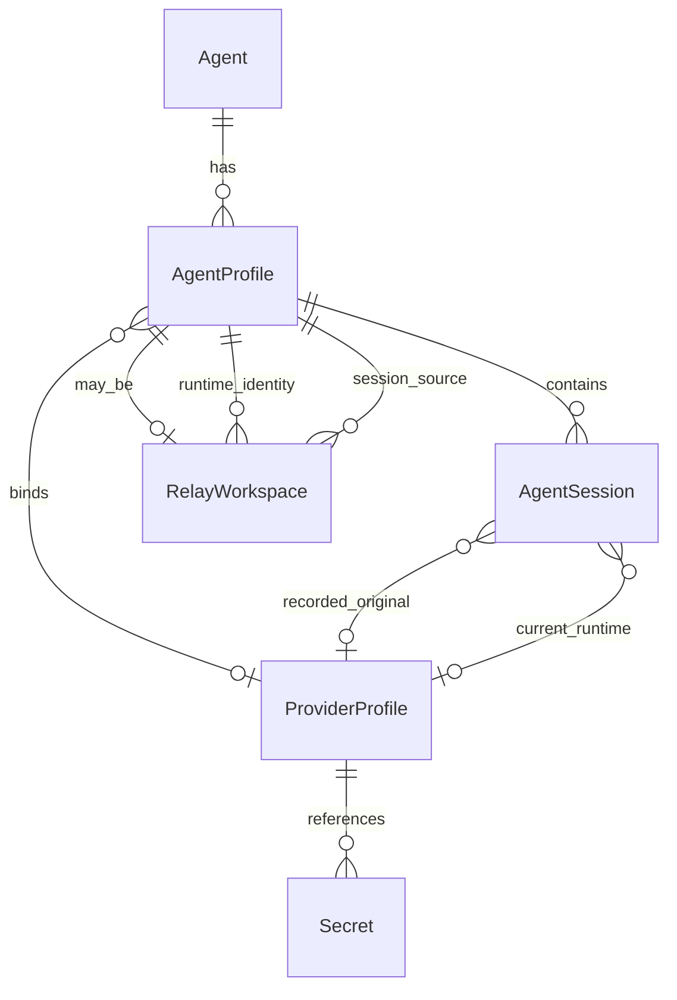

# LocalAgentManager (Lam) — 最终设计与分阶段实施方案

版本：1.2  
日期：2026-06-01  
状态：综合定稿（基于 `DESIGN_GOAL.md`、`codex-manager/`、`anotherdesign/` 与现有 `docs/`；v1.2 收敛 Phase 1 范围、额度采集、Provider 分期与 Lam 命名）

---

## 0. 文档目的与输入来源

本文档将以下内容收敛为**一份可执行的最终设计**：

| 来源 | 贡献 |
|------|------|
| `DESIGN_GOAL.md` | 长期愿景、九大设计目标、四阶段战略 |
| `anotherdesign/`（Codex Relay） | macOS 原生壳、分屏路由、Overview 仪表盘、活动时间线、简洁四栏导航 |
| `codex-manager/`（LocalAgentManager (Lam)） | Provider 一等公民、Relay/Sync/Inspector、安全与 mismatch 可视化 |
| `docs/01–05` | Tauri/Rust 架构、数据模型草案、安全策略、Command 契约 |

**设计原则（不可妥协）：**

```text
本地优先 · 不上传 session/代码/prompt
Account / Provider / Session 边界清晰
默认只同步 sessions/ · 不复制 auth.json · 不默认合并 history
所有写操作可 dry-run · 可审计 · 可追踪
底层模型从第一天起为多 Agent 预留，实现路径 Codex-first
```

---

## 1. 产品定位与命名

### 1.1 一句话定位

> **LocalAgentManager (Lam)** 是一个本地优先的 AI Coding Agent 工作区管理器：统一管理本机各 Agent 的账号目录、Provider、Session、Relay 与安全策略；首期完整解决 Codex 多账号与 session 接力，长期扩展至 Claude Code、OpenCode 等。

### 1.2 命名

| 项 | 名称 | 说明 |
|------|-----------|------|
| 对外产品名 | **LocalAgentManager** | 强调 local-first 和多 Agent 管理，不绑定单一 Codex 场景 |
| 简称 | **Lam** | UI 侧栏和紧凑场景使用 |
| 首个内置场景 | Codex account/session relay | Phase 1 仍 Codex-first，但品牌从一开始为多 Agent 预留 |
| 仓库/包名 | `localagentmanager` | 若现有仓库仍叫 `account-manager`，发布前再做仓库级迁移 |

**原型取舍：** 以 `codex-manager/index.html` 作为主原型，采用其信息架构与 Provider 能力，并已整合 `anotherdesign` 的 macOS 壳层、Overview 仪表盘、最近账号和活动时间线；不以单页塞满所有能力，也不拆成彼此割裂的静态页。

---

## 2. 两份原型的差异与合并策略

### 2.1 对比摘要

| 维度 | anotherdesign（Codex Relay） | codex-manager（Lam 主原型） |
|------|------------------------------|----------------------------------|
| 导航 | Overview · Accounts · Sessions · Settings | + Relay Workspaces · Providers · Sync Center |
| 布局 | 分文件路由 + iframe/导航切换 | 单页多 Panel + 右侧 Inspector |
| Provider | 未建模 | Provider Center、绑定、mismatch 警告 |
| Relay | Session 行内 Relay 按钮 + Overview 时间线 | 独立 Relay 页 + 创建向导 |
| 同步 | Settings 内 Sync 配置项 | Sync Center + 专用 Safe Sync 弹窗 |
| 视觉 | SF Pro、oklch、轻量 macOS titlebar | 深色开发者工具风、蓝青 Provider 强调 |
| 安全文案 | 基础 | auth/Keychain/history 策略显式化 |

### 2.2 合并后的信息架构（最终）

```text
┌─────────────────────────────────────────────────────────────┐
│  Titlebar: LocalAgentManager (Lam)          [Refresh] [?]    │
├──────────┬──────────────────────────────────┬───────────────┤
│ Sidebar  │  Main Content (route/panel)      │  Inspector    │
│          │                                  │  (contextual) │
│ Overview │                                  │               │
│ Accounts │                                  │  Session /    │
│ Sessions │                                  │  Sync /       │
│ Relay    │                                  │  Resume       │
│ Providers│                                  │  detail       │
│ Sync     │                                  │               │
│ ───────  │                                  │               │
│ Settings │                                  │               │
│ Quick    │                                  │               │
│ accounts │                                  │               │
└──────────┴──────────────────────────────────┴───────────────┘
```

- **Overview**：已整合进 `codex-manager/index.html`——统计卡片、最近账号、活动时间线、快捷操作（新建账号 / 新建 Relay / 打开 Sync）。
- **Accounts / Sessions / Relay / Providers / Sync**：以 codex-manager 为主实现；Sessions 保留 anotherdesign 的筛选（按账号、项目、cwd、Relay 状态）。
- **Inspector**：来自 codex-manager——选中 Session 时展示源/目标账号、原始/当前 Provider、mismatch 警告、Resume 命令、将影响哪些文件。
- **Settings**：合并两者——Terminal、wrapper 目录、Codex binary、高级危险项、默认 Sync 策略。

---

## 3. 领域模型（最终抽象）

### 3.1 核心实体关系



### 3.2 实体定义

#### Agent（Phase 2 起一等公民；Phase 1 隐式 `codex`）

```text
id: codex | claude-code | opencode | ...
display_name
binary_path (optional, detected)
version
capabilities[]  // scan_profiles, parse_sessions, generate_resume, relay
install_state: installed | missing | unknown
```

#### AgentProfile（Phase 1 = CodexAccount）

```text
id: main | a | b-relay-a
agent_id: codex
home_path: ~/.codex-a          // 即 CODEX_HOME
display_name
wrapper_path: ~/bin/codex-a
managed: bool
managed_metadata_path

// 认证与配置（只读探测，不读内容）
has_auth, has_config, has_history
auth_mode: chatgpt_login | api_key | none

// Provider 绑定（Phase 1 只读解析；Phase 1.5 支持写入/绑定）
provider_id
model
secret_ref: keychain | env:CODEX_* | none

// Relay 语义
kind: primary | relay
relay_source_profile_id
relay_runtime_profile_id

// 统计
session_count, last_active_at

// 额度（嵌入或关联 UsageQuotaSnapshot）
usage_summary: compact | null   // 侧栏/卡片用
```

#### UsageQuotaSnapshot（每个 AgentProfile 一份）

```text
profile_id
agent_id: codex
plan_type: plus | pro | team | api | unknown
fetched_at: ISO8601
source: live_app_server | experimental_wham | session_activity_estimate | stale_cache | unavailable
staleness: fresh | expired | unknown

windows[]:
  id: primary | secondary | code_review | custom
  label: Session | Weekly | Code Review    // UI 展示名
  used_percent: 0-100
  remaining_percent: computed
  reset_at: unix_seconds
  resets_in_seconds: computed
  window_seconds: 18000 | 604800 | ...
  pace: on_track | behind | ahead | unknown   // 可选，对比历史消耗
  pace_delta_percent: optional                 // 如 Behind (-42%)

alerts[]:
  level: ok | warn | critical
  code: QUOTA_HIGH | QUOTA_EXHAUSTED | STALE_DATA | NOT_LOGGED_IN
  message: user-facing

suggested_actions[]:
  switch_to_profile_id
  create_relay_from_source_id
```

**Codex 采集优先级（Adapter 实现）：**

| 优先级 | 方式 | 说明 |
|--------|------|------|
| 1 | `codex app-server` JSON-RPC `account/rateLimits/read` | 默认实时来源；按 `CODEX_HOME` 子进程隔离；App 不直接读取 token |
| 2 | `GET https://chatgpt.com/backend-api/wham/usage` | 实验性高级选项，默认关闭；需用户明确启用；非官方公开 API，可能变更 |
| 3 | 解析 `sessions/**/rollout-*.jsonl` 最近 `token_count` 事件 | 离线 fallback，只能表示近期 activity/估算，不伪装成实时剩余额度 |
| — | 未登录 | `source=unavailable`，引导 `codex-xxx login` |

**缓存：** `~/.config/agent-workspace/quota-cache/<profile_id>.json`，TTL 默认 5 分钟；设置项可改 1–60 分钟或关闭自动刷新。

#### ProviderProfile

```text
id: openai | company-proxy | ollama
name
base_url
wire_api: responses | chat_completions | ...
default_model
env_key (optional)
secret_storage: keychain | env | none
optional_headers (metadata only, not values)
health: ok | untested | error
used_by_profile_ids[]
```

**约束：** Provider 可复用；Secret 永不写入 `config.toml`、wrapper、日志或剪贴板明文。Phase 1 只读展示 Codex 现有 provider/config 状态；Phase 1.5 才提供 Provider CRUD、Keychain/env secret 管理和 Attach 写入。

#### AgentSession（Phase 1 = CodexSession）

```text
id
profile_id
agent_id
path
modified_at, size_bytes
cwd, summary, first_user_message

// Provider 感知（codex-manager）
original_provider_id, original_model
current_provider_id, current_model
provider_mismatch: bool

relay_ready: bool
resume_command_preview
```

#### RelayWorkspace

```text
id
home_path: ~/.codex-b-relay-a
runtime_profile_id: b        // 登录态来源
source_profile_id: a         // sessions 来源
provider_policy: inherit_runtime | inherit_source | explicit
created_at, last_sync_at
sync_manifest_ref (optional)
```

#### SyncPlan / SyncResult

```text
from_profile_id, to_profile_id
operations[]: copy | skip | backup
warnings[]: provider_mismatch, large_dir, ...
blocked_files[]: auth.json, *.sqlite, cache/, ...
dry_run: bool
```

#### ResumeCommand

```text
profile_id, session_id, cwd
command_string  // 已转义，可复制/开 Terminal
mode: specific | last | all_picker
side_effects[]  // 将读取/写入的路径说明
```

### 3.3 Phase 1 类型映射（实现时）

| 最终模型 | Phase 1 Rust/TS 名 | 存储 |
|----------|-------------------|------|
| Agent | 常量 `codex` | 无 |
| AgentProfile | `CodexAccount` | 磁盘目录 + `.managed-by-agent-workspace.json` |
| ProviderProfile | `ProviderProfile` | Phase 1 只读解析；Phase 1.5 存储到 `providers.json` + Keychain |
| AgentSession | `CodexSession` | 只读解析 `sessions/` |
| UsageQuotaSnapshot | `UsageQuotaSnapshot` | 内存 + `quota-cache/` |
| RelayWorkspace | `CodexAccount.is_relay` | 同 Profile |
| Secret | Keychain service | macOS Security.framework |

---

## 4. 核心用户流程（最终）

### 4.1 发现与总览

1. 启动 App → 扫描 `$HOME/.codex`、`$HOME/.codex-*`。
2. Overview 展示：账号数、Session 数、Relay 数、Provider 数、最近同步/接力事件。
3. 侧边栏 Quick accounts：一键跳转账号详情或 Session 列表。

### 4.2 创建受管账号

```text
输入 suffix (luna) → 预览 ~/.codex-luna + ~/bin/codex-luna
选择 Provider（可选，写入 config 引用而非明文 key）
可选从已有账号复制 config.toml（不含 auth）
dry-run → 创建目录 0700 → 写 wrapper → 写 managed metadata
可选：打开 Terminal 执行 codex-luna login
```

### 4.3 创建 Relay Workspace

```text
选择 runtime 账号 (B) + source 账号 (A)
生成 ~/.codex-b-relay-a + wrapper
Provider policy: 默认 inherit runtime，UI 展示 mismatch 风险
用户在 relay 目录完成 B 的 login（不复制 A 的 auth.json）
```

### 4.4 安全同步 Sessions

```text
选择 from → to（常为 A → b-relay-a）
默认: sync_sessions=true, backup_target=true, merge_history=false
build_sync_plan (dry-run) → UI 展示将复制/跳过/阻止的文件
用户确认 → execute_sync → 写入 sync manifest（可追溯）
```

**永远阻止：** `auth.json`、API key 文件、`* .sqlite*`、`cache/`、`tmp/`、`logs/`、`installation_id`。

### 4.5 Provider-aware Resume

```text
选择 Session → Inspector 展示:
  原始 agent/账号/Provider
  目标 relay/账号/当前 Provider
  mismatch 警告（如有）
  Resume 命令 + 「将影响哪些文件」
操作: Copy | Open Terminal.app | Reveal in Finder
```

### 4.6 查看账号额度与重置时间

**用户故事：** 作为多账号 Codex 用户，我希望在每个账号卡片上一眼看到 Session（5h）与 Weekly（7d）额度剩余和「多久后重置」，以便在额度耗尽前切换到另一账号或创建 relay，参考多 Agent 额度面板（进度条 + `X% used` + `Resets in …` + `Updated …`）。

**流程：**

```text
1. 扫描账号 → 对每个已登录 profile 拉取 UsageQuotaSnapshot
2. Overview / Accounts / 侧栏 Quick accounts 展示紧凑进度条
3. 选中账号 → Inspector 展示完整额度面板（含 Pace、计划类型）
4. 用户点击 Refresh 或到达自动刷新间隔 → 按 profile 独立刷新
5. 若 primary ≥90% 或 secondary ≥80% → 显示「建议切换到 codex-b」+ 一键 Create Relay
```

**非目标：** 不破解额度、不代为消耗额度、不提供「自动绕过限制」；仅只读展示官方/CLI 可得的限制信息。

---

## 5. UI/UX 规范（最终）

### 5.1 设计 Token（合并）

以 `anotherdesign` 的 oklch / SF 系为基础，叠加 `codex-manager` 的语义色：

```text
--bg, --surface, --surface2, --fg, --muted, --border
--accent (紫蓝，主导航/主按钮)
--accent-provider (青蓝，Provider 相关)
--success, --warn, --danger
--font-body: SF Pro / system-ui
--font-mono: SF Mono / JetBrains Mono
--radius-sm/md/lg
```

### 5.2 页面级需求清单

| 页面 | 必须模块 | 关键交互 |
|------|----------|----------|
| Overview | 4 指标卡、各账号状态迷你条（Phase 1.2 升级为额度条）、最近账号列表、活动时间线、CTA | New Account / New Relay / Sync、Refresh quotas（Phase 1.2） |
| Accounts | 卡片网格、Provider 行（Phase 1 只读）、Session/Weekly 额度条+重置倒计时（Phase 1.2）、Managed/Relay 标签 | 创建、查看 Session、Sync To、Login、Refresh（Phase 1.2） |
| Sessions | 全量表、筛选、Provider 列（Phase 1 只读） | Copy Resume、Relay、打开 Inspector |
| Relay | Relay 卡片、安全说明、Source/Runtime | Create、Safe Sync、Resume |
| Providers | Phase 1 只读/占位；Phase 1.5 为 Provider 卡、健康状态、账号绑定表 | Add、Test、Attach to Profile（Phase 1.5） |
| Sync Center | Phase 1 可保留为 Sync Dialog 入口；Phase 1.5 为策略说明、审计规则、最近同步记录 | Open Sync Dialog、查看 manifest |
| Settings | Binary、wrapper 目录、Terminal、高级项 | PATH 检查、危险选项开关 |
| Inspector | 选中上下文详情、额度面板（Phase 1.2 完整）、命令块、安全 Notice | 复制命令、开 Terminal、Refresh quota（Phase 1.2） |

### 5.2.1 额度 UI 组件规范（参考附图）

**紧凑模式（侧栏 Quick account / 账号卡片）：**

```text
┌─────────────────────────────────────┐
│ codex-a          Plus    Updated 2m │
│ Session  ████░░░░░░  2% used        │
│          Resets in 3h 53m           │
│ Weekly   ████░░░░░░  3% used        │
│          Resets in 3d 20h           │
└─────────────────────────────────────┘
```

- 进度条：`used_percent`；颜色 `<70%` 绿/蓝、 `70–89%` 琥珀、 `≥90%` 红。  
- 文案：`{used}% used` 左对齐，`Resets in {duration}` 右对齐（humanize：`3h 53m` / `3d 20h`）。  
- 顶部：`Updated just now` / `Updated 5m ago`；右侧计划徽章 `Plus` / `Max`。

**展开模式（Inspector / 账号详情）：**

- 增加 **Pace** 行：`Pace: Behind (-42%) · Lasts to reset`（有历史数据时）。  
- 多窗口：Codex `primary`→Session、`secondary`→Weekly；若有 `code_review_rate_limit` 单独一行。  
- 操作：**Refresh**、**Switch to …**、**Create relay from this account**（额度 ≥ 阈值时突出）。

**跨 Agent 长期（Phase 3+）：** Overview 顶部 Agent 切换条（Codex | Claude | Cursor …），每 Tab 下为该 Agent 的 profiles 额度，与附图一致。

### 5.3 模态框（最终集合）

1. **Add Managed Account** — suffix、Provider（Phase 1 只读选择/继承；Phase 1.5 可写绑定）、auth mode、model、copy config、login 引导  
2. **Add External Provider** — provider_id、base_url、wire_api、model、secret → Keychain/env（Phase 1.5）  
3. **Create Relay Workspace** — runtime、source、命名预览、provider policy  
4. **Sync Sessions Safely** — from/to、选项、dry-run 结果、blocked 列表、mismatch 横幅  
5. **Attach Provider to Account** — 选择 Provider + 写 config 引用（Phase 1.5）  

### 5.4 平台与响应式

- **主目标：** macOS 桌面（Tauri），最小窗口约 1100×700；Inspector 在窄屏可折叠为底部 Sheet。  
- **实现技术：** Tauri v2 + Rust + React + Vite（沿用 `docs/02`）。  
- 原型中的 Web 响应式矩阵用于未来可能的 Web 管理端，**不作为 Phase 1 交付范围**。

---

## 6. 技术架构（最终）

### 6.1 分层

```text
┌─────────────────────────────────────────┐
│  React UI (routes + Inspector + modals) │
├─────────────────────────────────────────┤
│  Frontend API (invoke + React Query)    │
├─────────────────────────────────────────┤
│  Tauri Commands (validation, errors)    │
├─────────────────────────────────────────┤
│  Services                               │
│  · AgentRegistry (Phase 2)              │
│  · CodexAdapter (Phase 1)               │
│  · AccountScanner / SessionParser       │
│  · ProviderStore / SecretStore          │
│  · SyncEngine / RelayFactory            │
│  · UsageQuotaService / QuotaCache       │
│  · WrapperWriter / TerminalLauncher     │
│  · AuditLog / SyncManifestStore         │
├─────────────────────────────────────────┤
│  Local FS + Keychain                    │
└─────────────────────────────────────────┘
```

### 6.2 目录结构（目标仓库）

```text
localagentmanager/
├── apps/desktop/              # Tauri app
│   ├── src/                   # React
│   └── src-tauri/src/
│       ├── adapters/codex/
│       ├── services/
│       └── commands/
├── packages/shared-types/       # TS types 与 Rust 共享 serde
├── docs/
├── codex-manager/             # UI 原型（参考）
├── anotherdesign/             # UI 原型（参考）
└── DESIGN_GOAL.md
```

### 6.3 Command API 扩展（相对 docs/05）

在现有 `list_accounts`、`create_account`、`create_relay`、`build_sync_plan`、`execute_sync`、`build_resume_command` 基础上分阶段增加：

```text
// Provider（Phase 1.5）
list_providers()
create_provider(req)           // secret → Keychain
update_provider(id, req)
delete_provider(id)
test_provider(id)
attach_provider_to_profile(profile_id, provider_id, opts)

// Provider 解析（Phase 1 只读；Phase 1.5 支持写入后的解析）
resolve_profile_provider(profile_id) -> ProviderBinding

// 审计
list_sync_manifests(limit)
get_sync_manifest(id)

// 额度（Phase 1.2，只读）
get_profile_quota(profile_id, force_refresh?: bool) -> UsageQuotaSnapshot
refresh_all_quotas(profile_ids?: string[]) -> QuotaRefreshResult
get_quota_refresh_settings() -> QuotaRefreshSettings
set_quota_refresh_settings(settings)
```

所有写命令：**先支持 `dry_run: true` 返回 plan**，与 `execute_*` 分离。额度相关命令**只读**，不修改 `auth.json`。

实现约束：

```text
create_account / create_relay / attach_provider / create_provider / update_provider
  均必须支持 dry_run 或独立 plan_* command。

返回结构至少包含：
  operations[]       // 将创建/写入/备份/跳过的路径或资源
  blocked[]          // 被安全策略阻止的路径或字段
  warnings[]         // mismatch、PATH、权限、非官方 API 等
  requires_confirm   // 是否需要用户二次确认
```

### 6.4 额度服务设计（CodexAdapter）

```rust
pub trait UsageQuotaProvider {
    fn fetch_quota(&self, profile: &AgentProfile, force: bool) -> Result<UsageQuotaSnapshot>;
}

// Codex: 子进程 CODEX_HOME=... codex app-server → rateLimits/read
// Fallback: 解析 sessions jsonl token_count，仅作为 activity estimate
// Cache: QuotaCache with TTL
```

**安全：**

- 默认路径不直接读取 `auth.json` 内容；实时额度优先通过隔离的 Codex 子进程获取。  
- `wham/usage` 仅作为实验性高级选项，默认关闭；启用时必须在 UI 中说明“App 会在内存中读取该 profile 的 OAuth token，不写入日志/前端/持久化”。  
- 网络请求仅指向 `chatgpt.com`（若走实验性 wham/usage），禁止附带项目路径或 session 内容。  
- UI 固定免责声明：「额度数据来自 OpenAI/Codex，非官方保证；以服务商为准。」

### 6.5 Provider 存储（Phase 1.5）

```text
~/.config/agent-workspace/
  providers.json          # 非敏感元数据
  settings.json
  quota-cache/
    <profile_id>.json     # 非敏感额度快照
  sync-manifests/
    <uuid>.json

Keychain:
  service: agent-workspace-manager
  account: provider:<provider_id>
```

`config.toml` 中仅保存 `provider_id` 或 Codex 原生字段引用，**不保存 api_key 明文**。

---

## 7. 安全与合规（最终，与 docs/03 对齐并加强）

| 级别 | 路径/数据 | 策略 |
|------|-----------|------|
| L0 默认禁止读内容 | `auth.json` 内容 | 默认仅 `exists` 检查；实时额度默认走 `codex app-server` 子进程 |
| L0 实验性例外 | OAuth token | 仅用户显式开启 `wham/usage` 时内存读取；不进日志、前端、缓存、manifest |
| L0 禁止复制 | `auth.json`、API key 文件 | Sync 硬编码 block |
| L1 默认不同步 | `history.jsonl` | 仅 sidecar 备份可选 |
| L1 默认不同步 | sqlite、cache、tmp、logs | block |
| L2 默认同步 | `sessions/` | 合并策略：不覆盖同路径或按 size+mtime 跳过 |
| L3 用户确认 | 任何写 FS、写 wrapper、开 Terminal | dry-run + 明确文案 |

**Provider mismatch：** 不阻止 resume，但必须二次展示警告（codex-manager 原型行为）。

**开源合规：** 不协助绕过额度；不托管他人 token；README 与 UI 固定展示安全原则。

---

## 8. 分阶段实施路线图（最终）

### Phase 0 — 流程验证（1–2 周）

**目标：** 验证 Codex 多账号 + session relay 闭环，不追求 UI 完整。

| 交付 | 说明 |
|------|------|
| CLI/脚本或现有 Node 原型 | 扫描、sync、resume 命令生成 |
| 假数据集成测试 | `.fake-home/.codex-*` |
| 决策冻结 | 采纳本文档 IA 与数据模型 |

**退出标准：** 能在本地完成 A → `b-relay-a` sync 并成功 `codex resume`，且不触碰 auth。

---

### Phase 1 — Codex MVP（6–8 周）

**产品名：** LocalAgentManager (Lam)  
**目标：** 可安装的 macOS App，先完成 Codex 多账号、session relay、safe sync、resume 的核心闭环。Phase 1 是第一阶段的可用 MVP；`DESIGN_GOAL` 第一阶段的实时额度与完整 Provider Center 分别在 Phase 1.2、Phase 1.5 补齐。

| 模块 | 范围 | 不含 |
|------|------|------|
| Accounts | 扫描、创建、wrapper、managed 标记 | Provider 自动写 config |
| Sessions | 列表、解析、筛选、Inspector 基础 | 跨 agent |
| Relay | 创建 relay 目录、元数据 | 自动 login |
| Sync | dry-run + 执行 + 备份 + manifest | history merge |
| Resume | 命令生成、复制、Terminal.app | iTerm/Warp |
| Overview | 统计 + 简时间线 | 云同步、完整额度 API |
| Settings | binary、wrapper 目录、Terminal | — |
| Provider（基础） | 从现有 `config.toml` 只读解析 provider/model，展示 badge | Provider CRUD、Keychain 写入、Attach |
| Usage（基础） | 从 session jsonl 展示近期 token activity / stale estimate | 真实剩余额度、重置倒计时、菜单栏 |

**UI：** 以合并后的 IA 实现；Providers 页可显示只读状态或「Coming in 1.5」，Sync Center 可先作为 Sync Dialog / manifest 入口，不要求完整 Provider/Sync 管理台。

**技术：** Tauri + Rust services + React；metadata 文件名 `.managed-by-agent-workspace.json`（兼容旧名可选读取）。

**发布：** v0.1.0 — macOS `.dmg` + 源码 + README 安全说明。

---

### Phase 1.2 — 实时额度面板（2–3 周）

**目标：** 对齐 `DESIGN_GOAL` §7 与用户附图；每个账号可刷新 Session/Weekly 额度与重置倒计时。

| 交付 |
|------|
| `UsageQuotaService` + `get_profile_quota` / `refresh_all_quotas` |
| Codex：`codex app-server` 优先，jsonl fallback 仅显示 activity estimate |
| 实验性 `wham/usage` 高级开关（默认关闭，需明确安全提示） |
| Accounts 卡片 + 侧栏 + Inspector 额度 UI |
| Overview 账号额度迷你条 + 「额度紧张」建议切换/relay |
| Settings：自动刷新间隔、警告阈值（70%/90%） |
| 额度缓存与 `Updated X ago` 展示 |

**发布：** v0.1.2

**验收：**

1. 已登录的 `~/.codex-a` 显示 Session/Weekly 百分比与 `Resets in …`。  
2. 手动 Refresh 后 `fetched_at` 更新；未登录账号显示「需要 login」而非假数据。  
3. 默认实现不直接读取 `auth.json` token；若用户开启实验性 wham，token 不进入日志、前端、缓存或 sync manifest。

---

### Phase 1.5 — Provider & Secret（3–4 周）

**目标：** 对齐 DESIGN_GOAL 的 Provider Center 与 codex-manager 原型。

| 交付 |
|------|
| Provider CRUD + Keychain 存储 |
| Profile ↔ Provider 绑定与解析 |
| Session 行显示 original/current provider |
| Sync / Resume 的 mismatch 警告 |
| Add Provider / Attach 模态框 |
| Providers 页、Sync Center 完整实现 |

**发布：** v0.2.0

---

### Phase 2 — 通用 Agent 抽象（4–6 周）

**目标：** DESIGN_GOAL 第二阶段；重构但不破坏 Codex 功能。

| 交付 |
|------|
| `Agent`、`AgentAdapter` trait |
| `AgentProfile`、`AgentSession` 泛型化 |
| `AgentRegistry`：注册 CodexAdapter |
| 统一 `RelayWorkspace` 与 `SyncEngine` 接口 |
| 统一 `Secret` / `ProviderProfile` 服务 |
| 命令 API 版本化（`v2_*` 或兼容层） |

**数据迁移：** `CodexAccount` → `AgentProfile` 字段映射工具（一次性）。

---

### Phase 3 — 多 Agent 扩展（按 Agent 增量）

每个 Agent 一个迭代（2–4 周/Agent）：

| Agent | Adapter 职责 |
|-------|----------------|
| Claude Code | 探测配置目录、session 路径、resume 命令 |
| OpenCode | 同上 |
| Reasonix / Aider / Cursor | 社区优先级排序 |

**UI：** Overview 增加 Agent 筛选；侧边栏按 Agent 分组 Profile。

---

### Phase 4 — Agent Workspace 控制台（持续演进）

**目标：** DESIGN_GOAL 第四阶段。

```text
跨 Agent 统一 Session 浏览
Handoff 工作流（跨 agent 上下文接力，文件级保守策略）
Workspace 模板（预置目录结构 + Provider 包）
插件/Adapter SDK 文档
可选：菜单栏快捷切换、CLI `awm` 命令
可选：菜单栏仅显示额度（Compact quota bar，多 Agent Tab）
```

---

## 9. 里程碑与验收标准

### 9.1 Phase 1 MVP 验收（必须全部满足）

1. 1 分钟内创建受管账号目录 + wrapper。  
2. 从 A 同步 session 到 `b-relay-a` 并可 resume，**不**覆盖 B 的 history。  
3. **从不**复制 `auth.json`（自动化测试 + 手工检查）。  
4. 任意 sync 可先 dry-run，用户能看到将改动的文件列表。  
5. Overview 可看到本机所有 `~/.codex*` 账号与 session 计数。  
6. Provider 信息在 Phase 1 只读展示，不提供会写配置的 Provider CRUD。  
7. Usage 基础态明确标注为 activity/estimate，不展示伪造的剩余额度或重置时间。  
8. 开源用户 5 分钟内按 README 跑起 App。

### 9.2 Phase 1.2 验收（额度）

1. 至少两个已登录 Codex 账号独立显示额度，互不串数据。  
2. Session 与 Weekly 窗口均展示 `used%` 与重置倒计时。  
3. 额度 ≥ 配置阈值时，账号卡片出现警告样式与「切换/relay」建议。  
4. 离线时 fallback 为 activity estimate 或显示「数据过期」，不展示伪造 0%。
5. 默认路径不直接读取 `auth.json` 内容；实验性 wham 读取必须有显式开关与安全提示。

### 9.3 Phase 1.5 验收

1. Provider 可创建并存入 Keychain，UI 无明文 key。  
2. Session 列表可显示 provider mismatch。  
3. Relay resume 前 Inspector 展示完整边界信息（账号/Provider/路径/命令）。

### 9.4 长期指标

- Session relay 成功率（用户反馈）。  
- 因误同步导致的数据事故 = 0。  
- Adapter 接口稳定，新增 Agent 不需改动 Sync 核心。

---

## 10. 与现有文档的关系

| 文档 | 状态 |
|------|------|
| `DESIGN_GOAL.md` | 战略输入，长期目标不变 |
| `docs/01-product-design.md` | 被本文档 supersede（Codex 细节以本文为准） |
| `docs/02-development-design.md` | 技术栈与 Rust 结构仍有效；模型以 §3 为准 |
| `docs/03-security-and-data-safety.md` | 继续有效；Provider secret 与额度实验性 token 读取例外见 §6.4 / §7 |
| `docs/04-roadmap.md` | 被 §8 替代 |
| `docs/05-tauri-command-contracts.md` | 基础契约有效；扩展见 §6.3 |
| `codex-manager/index.html` | UI 主参考（Provider 页、Inspector、模态） |
| `anotherdesign/screens/*` | Overview 布局与 macOS 壳参考 |
| `codex-session-manager-managed/` | Phase 0 Node/Bun 流程验证参考；不能直接作为 Phase 1 安全实现 |

**Phase 0 原型限制：** `codex-session-manager-managed` 是 Node/Bun 本地网页原型，用于验证扫描、创建 wrapper、session 同步和 resume 命令生成。它缺少 Phase 1 必需的 `build_sync_plan` / `execute_sync` 双阶段、同步前目标 sessions 备份、sync manifest、Provider/Usage 模型和正式 Tauri/Rust 安全边界；其中 history merge 能力不进入 Phase 1。

---

## 11. 风险与决策记录

| 风险 | 缓解 |
|------|------|
| Codex session 格式变更 | 保守解析 + 文件名 fallback；不修改 session 内容 |
| app-server 接口变更 | Adapter 版本探测 + fallback jsonl activity estimate + UI 标明「非官方保证」 |
| wham/usage 读取 token 带来安全边界扩大 | 默认关闭；仅高级实验开关；token 只在内存中使用且不进日志/前端/缓存 |
| 额度查询频繁 | 默认 5min 缓存；按 profile 并行上限；用户可调间隔 |
| Provider 配置与 Codex 官方 config 不同步 | Adapter 负责读写；文档标明支持的 config 字段 |
| 用户误开 history merge | Phase 1 不实现 merge；仅 sidecar 备份 |
| 范围膨胀 | Phase 1 严格不含多 Agent、不含 history merge、不含云 |
| 两原型命名不一致 | 主原型统一为 LocalAgentManager (Lam)；`codex-manager/` 仅作为原型目录名保留 |

---

## 12. 建议的下一步（实施顺序）

1. 在 `apps/desktop` 初始化 Tauri + React 脚手架，冻结 design tokens。  
2. 实现 Rust `AccountScanner` + `list_accounts` / `list_sessions`（无 UI 亦可测）。  
3. 实现 Overview + Accounts + Sessions 三页（真实数据）。  
4. 实现 SyncEngine + Relay 创建 + Resume（Phase 1 核心闭环）。  
5. 对齐 `codex-manager` 模态文案与 Inspector，Provider 先做只读展示。  
6. Phase 1.2 接 `UsageQuotaService`，默认使用 `codex app-server`。  
7. Phase 1.5 接 ProviderStore + Keychain。  
8. Phase 2 抽 `AgentAdapter` trait，Codex 迁入 adapter  crate。

---

**文档维护：** 当 Phase 1 启动开发时，将 `docs/04-roadmap.md` 重定向到本文 §8，并在 PR 模板中引用 §9 验收项。
